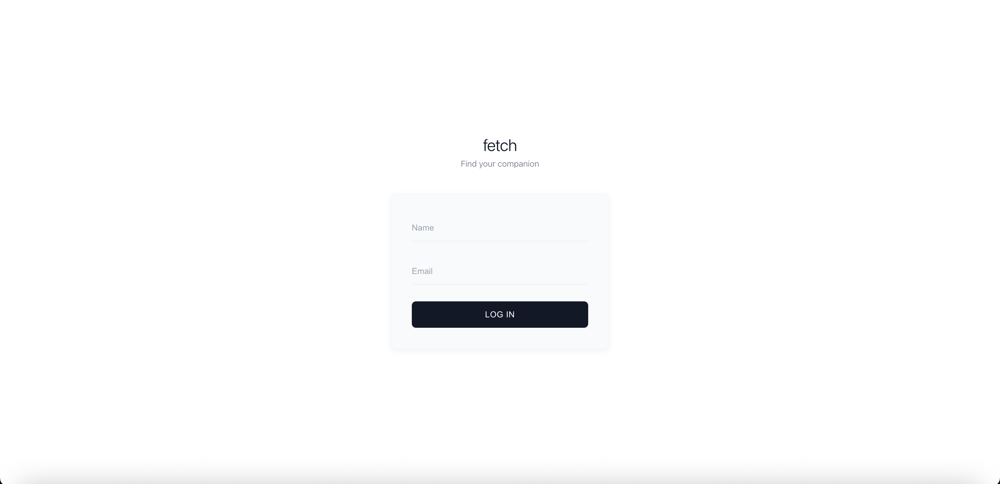
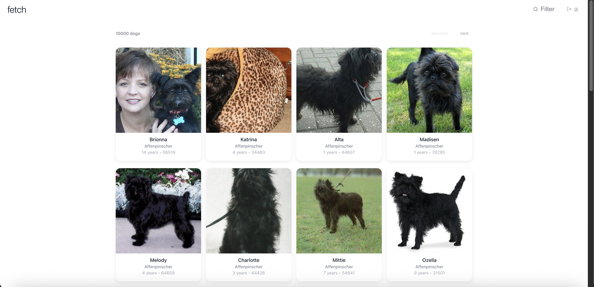
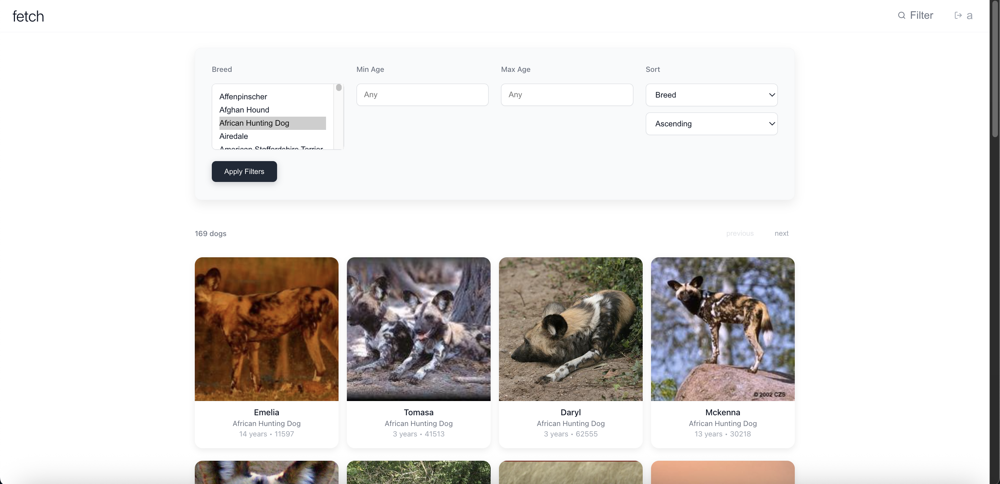

# fetchFE

To run this project: 

- clone the repo
- npm install
- npm start

It will begin with a log in screen 

You will then be directed to the main search page

You can filter through the dogs with the filter button up top

Finally you can find your match

